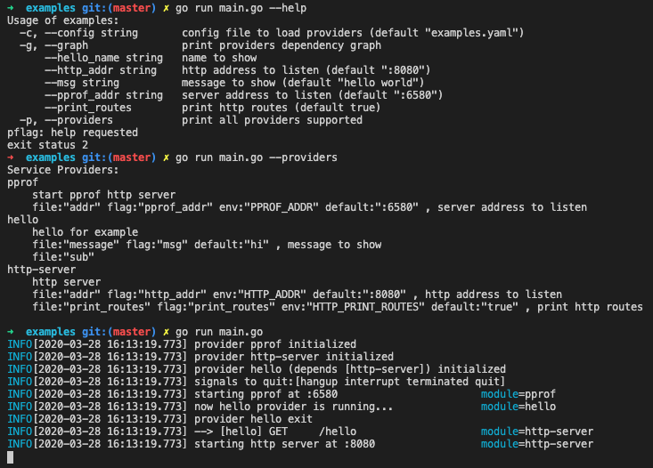

# servicehub
服务管理器 *servicehub.Hub*，管理服务的启动、初始化、依赖关系、关闭等

实现 *servicehub.Provider* 接口来提供服务

## 例子
配置文件 *examples.yaml*
```yaml
http-server:
    addr: ":8080"

pprof:
    addr: ":6580"

hello:
    message: "hello world"
```
*main.go*
```go
package main

import (
	"bytes"
	"fmt"
	"io"
	"net/http"
	"os"

	"github.com/recallsong/go-utils/logs"
	"github.com/recallsong/go-utils/logs/logrusx"
	"github.com/recallsong/servicehub"
	"github.com/recallsong/servicehub/providers/httpserver"
	_ "github.com/recallsong/servicehub/providers/pprof"
)

type subConfig struct {
	Name string `file:"name" flag:"hello_name" default:"recallsong" desc:"name to show"`
}

type config struct {
	Message   string    `file:"message" flag:"msg" default:"hi" desc:"message to show"`
	SubConfig subConfig `file:"sub"`
}

type helloProviderDefine struct{}

func (d *helloProviderDefine) Service() []string {
	return []string{"hello"}
}
func (d *helloProviderDefine) Dependencies() []string {
	return []string{"http-server"}
}

func (d *helloProviderDefine) Summary() string {
	return "hello for example"
}

func (d *helloProviderDefine) Description() string {
	return d.Summary()
}

func (d *helloProviderDefine) Creator() servicehub.Creator {
	return newProvider
}

func (d *helloProviderDefine) Config() interface{} {
	return &config{}
}

type helloProvider struct {
	Cfg    *config
	Logger logs.Logger
}

func newProvider() servicehub.Provider {
	return &helloProvider{}
}

func (p *helloProvider) Init(ctx servicehub.Context) error {
	// 获取依赖的 http-server 服务
	routes := ctx.Service("http-server").(httpserver.Router)
	routes.GET("/hello", func(resp http.ResponseWriter, req *http.Request) {
		resp.Write([]byte(p.Cfg.Message))
	})
	return nil
}

func (p *helloProvider) Start() error {
	p.Logger.Info("now hello provider is running...")
	return nil
}

func (p *helloProvider) Close() error {
	p.Logger.Info("now hello provider is closing...")
	return nil
}

func init() {
	servicehub.RegisterProvider("hello", &helloProviderDefine{})
}

func main() {
	hub := servicehub.New(
		servicehub.WithLogger(logrusx.New()),
	)
	hub.Run("examples", os.Args...)
}
```
[例子详情](./examples/main.go)

## 运行效果


## 配置读取
支持以下方式获取配置，读取优先级由低到高分别为：
* default Tag In Struct
* System Environment Variable
* .env File Environment Variable
* Config File
* Flag

支持的配置文件格式：
* yaml、yml
* json
* hcl
* toml
* ...

## Providers
*github.com/recallsong/servicehub/providers* 包下已实现了几个 *Provider*。如 *http-server*、*pprof*
### http-server
http-server ServiceProvider 提供 http 服务器，供其他 Provider 使用。

支持拦截器、多种请求处理器，*请求参数* 和 *返回参数* 不分顺序

#### 请求参数
支持请求类型:
* http.ResponseWriter
* *http.Request
* httpserver.Context
* struct or struct Pointer
* map[string]interface{} or map[string]interface{} Pointer
* []byte
* string
* slice

#### 数据校验
支持结构体数据校验，参考 **github.com/go-playground/validator**

#### 返回参数
支持返回类型：
* int 表示 Response Status
* io.ReadCloser
* io.Reader
* interface{}
* error

#### 拦截器
```go
func(handler func(ctx httpserver.Context) error) func(ctx httpserver.Context) error {
    return handler // 返回新的处理器
}
```

## TODO List
* CLI tools to quick start
* Test Case
* More Providers

## License
[Licensed under MIT](./LICENSE)